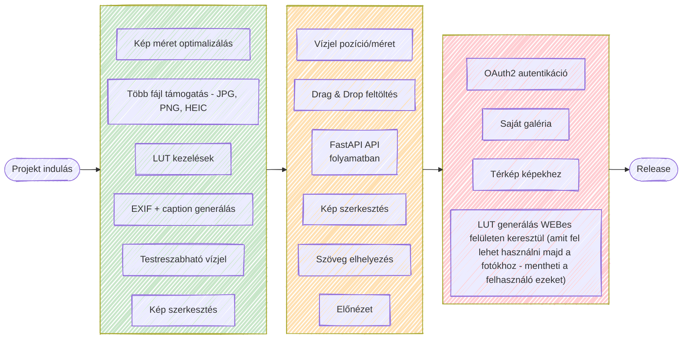
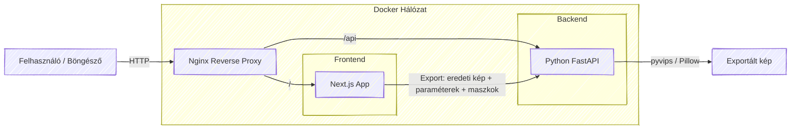

    

  <h2>Gyorsítsd fel a fotós workflow-d!</h2>
  
<em>EXIF adatok kinyerése és manipulálása, képszerkesztés és közösségi médiára felkészítés egy helyen.</em>

  <a href="#technológiák">Technológiák</a> |
  <a href="#roadmap">Roadmap</a> |
  <a href="#architektúra">Architektúra</a> |
  <a href="/docs/START_DEV.md">Első indítás (Fejlesztői)</a> |
  <a href="#screenshot">Screenshot</a> |
  <a href="#közreműködés">Közreműködés</a> |

---

## Vízió

> **Cél:** Megkönnyíteni a fotósok közösségi média munkafolyamatát – hogy az alapvető feladatokhoz ne legyen szükség professzionális képszerkesztő szoftverekre.

Az **WizPX** segítségével a fotósok *percek alatt* közösségi médiára kész képeket hozhatnak létre, egy egyszerű és átlátható webes felületen.

### Főbb funkciók:

#### Feldolgozás
- `JPG`, `PNG`, `HEIC` támogatás
- EXIF adatokból caption-ök generálása *(késöbb a szövegnél is elérhető lesz)*

#### Szerkesztés
- Expozíció / fényerő / kontraszt / színhőmérséklet / tint / telítettség / vibrance (bőrtónus védelemmel) / hue / levels / gamma
- Channel mixer
- LUT
- **Maszkolás:** rétegenként egérrel rajzolt (puha szélű) maszk, a szűrők csak a maszkolt területre hatnak
- Átméretezés, szöveg, vízjel

#### Export
- Vízjel
- Szöveg a fotóra
- Képkeret
- Közösségi médiára optimalizálás (expand / crop)

#### LUT készítése (tervezet)

<a href="#top">Vissza a tetejére</a>

---

## Technológiák

|     Terület     |                           Technológia                           |                     Miért?                     |
|:---------------:|:---------------------------------------------------------------:|:---------------------------------------------:|
| *Frontend*      |  | Gyors, reszponzív UI komponensek React alapokon |
| *UI library*    |  |  |
| *Képfeldolgozás (böngésző)* | Pixi.js (WebGL / GLSL) | Valós idejű szűrők és maszkok GPU-n |
| *Backend*       |  | Modern Python REST API, az exportált kép előállítása (pyvips + Pillow) |
| *Futtatás*      |  | Könnyen telepíthető, konténerezett környezet    |

<a href="#top">Vissza a tetejére</a>

---

## Roadmap

**Kiemelt feature táblázat**

| Funkció | Státusz |
|--------|--------|
| EXIF kinyerés | ✅ Kész |
| Caption generálás | ✅ Kész |
| Vízjel | ✅ Kész |
| Cropolás / Expandolás | ✅ Kész |
| Képkeret funkció | ✅ Kész |
| Szerkesztés (szűrők, channel mixer) | ✅ Kész |
| Maszkolás (rajzolt maszk rétegek) | 🟡 Folyamatban (teljesítmény optimalizálás) |
| LUT használata / készítése | 🟡 Folyamatban |

<a href="#top">Vissza a tetejére</a>

---

## Architektúra

> A szerkesztés előnézete teljesen a böngészőben (Pixi.js / WebGL) fut. A backend állapotmentes, nincs adatbázis és nincs tartós fájltárolás: az exportálásnál a kép és a szerkesztési paraméterek (szűrők, LUT, maszkok, szöveg, vízjel, keret) érkeznek meg, és a kész kép megy vissza válaszként.

<a href="#top">Vissza a tetejére</a>

---

## Screenshot

> [!WARNING]
> **BÉTA verzió (2026.05.21)** – hibák előfordulhatnak!

 

<a href="#top">Vissza a tetejére</a>

---

## Közreműködés

A projekt jelenleg **fejlesztés alatt** áll, ezért külső hozzájárulás még nem elérhető.

**Későbbiekben**:

* PR-ek fogadása
* Hibajelentés és feature javaslatok
* `CONTRIBUTING.md` dokumentáció

  

<a href="#top">Vissza a tetejére</a>

---

&nbsp;

&nbsp;

